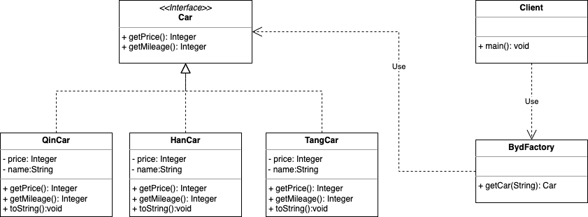

# 工厂模式

## 前言

前天我的Mac到了。很奇怪，等待发货的那段时间心急如焚，到货之后心如止水，没有了半分激动，难道这就是爱情。这个电脑对我有重大意义，我为此定制了一系列计划，而设计模式是第一步，先从设计模式开始吧。一般容易放弃的人才喜欢立坚持的flag，没错，俺也一样。**日拱一卒，功不唐捐**。

## 介绍

工厂模式是Java中最常用的设计模式之一，我们在工作中也经常用到。用到的情况很可能是这两种：一是开发新功能，而是优化老代码。当我们遇到的需求是在不同情况下需要创建不同实例时，就会用到工厂模式。注意，是创建不同对象时用到，重点是对象创建。

### 背景知识

在介绍之前我们先明确一下产品和产品族的概念，主要是为了理解后面的模式。

对于汽车而言有不同的品牌，比如说特斯拉，比亚迪，大众等。我们把每个品牌定义为一个产品族。每个品牌下面有不同的型号，比亚迪有唐 宋 元 明 清<!--叫着顺口，可能没有-->，特斯拉有S 3 X Y，这种不同的型号定义为不同的产品。

### 结构

定义一个创建对象的接口，多个子类对其进行实现。定义一个工厂类，根据客户端传递的参数决定创建对象的类型。

比如说我们创建一个汽车产品接口，不同型号的汽车实现该接口，然后创建一个汽车工厂类，该工厂类提供一个根据汽车配置创建对应汽车的方法。

**优点**：同层级扩展性高，当我们在产品中新增一个汽车型号的时候，只需要创建一个子类实现接口就可以了。创建简单，工厂类根据类别名称可直接创建对象。

**缺点：**相同层级扩展性低，如果想要新增一个产品，就需要创建新的具体类和一个工厂

## 提出问题

比亚迪品牌有比亚迪秦，比亚迪汉，比亚迪唐，请问，如何创建对象以及打印汽车品牌参数。

## 实现

我们将创建一个汽车接口类，接口类中有获取汽车里程、获取汽车价格、汽车参数打印三个方法，不同配置的汽车实现该接口，定义一个比亚迪秦汽车工厂，根据传递的汽车参数low、middle、high决定生成对象。




### 车辆接口类

```java
public interface Car {
    Integer getPrice();
    Integer getMileage();
  	// 定义一个default类用于打印信息，实现类通用
  	default void print(){
        System.out.println("车辆价格："+getPrice()+",车辆里程："+getMileage());
    }
}
```

### 接口实现类

```
// low
import com.hello.designPattern.interfaces.Car;
public class QinLowCar implements Car{

    @Override
    public Integer getPrice() {
        return 50000;
    }

    @Override
    public Integer getMileage() {
        return 100;
    }

}
// middle
import com.hello.designPattern.interfaces.Car;

public class QinMiddleCar implements Car{

    @Override
    public Integer getPrice() {
        return 60000;
    }

    @Override
    public Integer getMileage() {
        return 200;
    }
}
// high
import com.hello.designPattern.interfaces.Car;

public class QinHighCar implements Car{

    @Override
    public Integer getPrice() {
        return 65000;
    }

    @Override
    public Integer getMileage() {
        return 300;
    }

}
```

### 工厂类

```
import com.hello.designPattern.interfaces.Car;
import com.hello.designPattern.model.QinHighCar;
import com.hello.designPattern.model.QinLowCar;
import com.hello.designPattern.model.QinMiddleCar;

public class QinCarFactory {

    public static Car getCar(String carType) throws IllegalAccessException {
        return switch (carType) {
            case "low" -> new QinLowCar();
            case "middle" -> new QinMiddleCar();
            case "high" -> new QinHighCar();
            default -> throw new IllegalAccessException("param error");
        };
    }
}
```

### 总结

看到这个地方，估计大家都明白了，如果有不明白再私信我。现在这种情况是工厂模式的最佳形态，当我们需要新增一个配置的时候，只需要新增一个类就可以了，相同层级扩展性较高。

但是当我们需要新增一个型号时，比如说